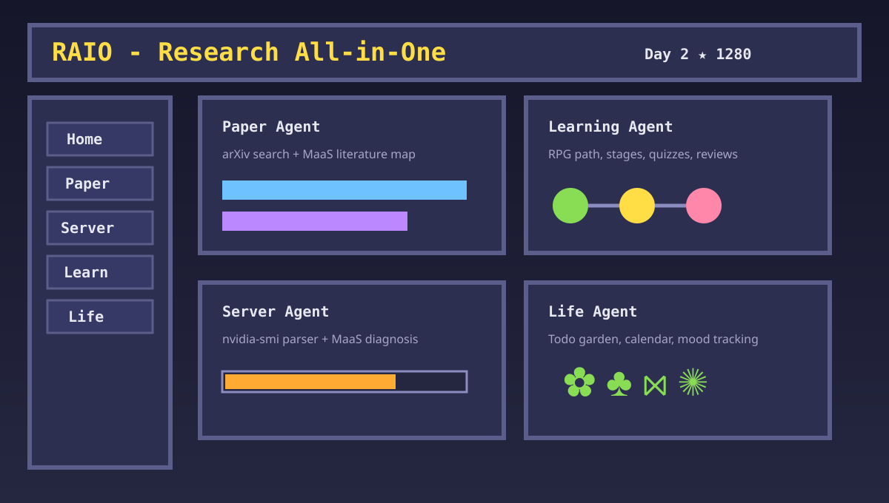
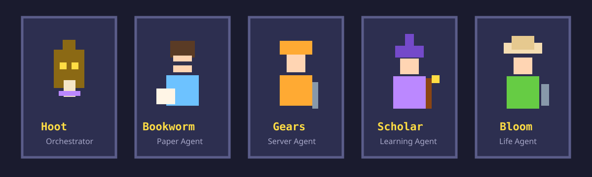

# RAIO - Research All-in-One



RAIO is a local-first research companion with a warm pixel-lab interface. It combines paper discovery, server diagnostics, learning paths, life planning, star rewards, and agent wardrobe changes behind a Huawei MaaS model proxy.



## Features

| Module | What It Does |
| --- | --- |
| Lumo / Home | Central chat, intent guidance, research-day status, persistent stars and progress. |
| Paper Agent | Backend-proxied arXiv search, query decomposition, MaaS literature-map synthesis, paper Q&A, and a pixel Paper Vault bookshelf. |
| Server Agent | Local SSH control console, safe remote inspection commands, `nvidia-smi` parser, GPU cards, MaaS diagnosis, command cards, and recent status history. |
| Learning Agent | MaaS-generated RPG learning paths, stage completion, progress bar, self-review, and quiz feedback. |
| Life Agent | Todo seeds, priority and due dates, weekly pixel calendar, garden growth, mood logs, and MaaS care responses. |
| Wardrobe | Five agent characters with unlockable outfits and local-only state. |

## MaaS Backend

The browser never receives your MaaS key. Frontend calls go to the local Node proxy at `/api/maas/chat`, and `server.mjs` forwards requests to Huawei MaaS.

Paper search also goes through the local proxy at `/api/papers/arxiv`, so arXiv XML parsing happens in Node instead of the browser. This avoids common browser-side CORS and network-policy failures.

Default configuration:

```env
MAAS_API_URL=https://api.modelarts-maas.com/v2/chat/completions
MAAS_MODEL=deepseek-v4-flash
```

## Quick Start

```bash
npm install
cp .env.local.example .env.local
# Fill MAAS_API_KEY in .env.local
npm run dev
```

Open:

```text
http://127.0.0.1:5173/
```

Check the model connection:

```bash
curl http://127.0.0.1:5173/api/maas/status
```

Expected shape:

```json
{
  "configured": true,
  "endpoint": "https://api.modelarts-maas.com/v2/chat/completions",
  "model": "deepseek-v4-flash"
}
```

## Production Build

```bash
npm run build
npm run preview
```

## Project Structure

```text
RAIO/
├── src/
│   ├── main.tsx       # App state, agents, modules, MaaS calls
│   └── styles.css     # Pixel UI, layout, garden, sprite styling
├── public/
│   └── assets/        # Local sprite assets, gitignored when using the full pack
├── server.mjs         # Local MaaS proxy + Vite middleware/static server
├── docs/              # README visuals
├── refs/              # Planning documents
└── .env.local.example # Local MaaS config template
```

## Local Assets

RAIO can use a local pixel asset pack for the five agent sprites. The full extracted asset directory is intentionally gitignored because it is large and should remain local to the workspace.

Current character mapping:

| Agent | Sprite |
| --- | --- |
| Lumo | `Characters/Junimo..png` |
| Bookworm | `Characters/Penny..png` |
| Gears | `Characters/Clint..png` |
| Scholar | `Characters/Wizard..png` |
| Bloom | `Characters/Robin..png` |

## Security Notes

- `.env.local` is gitignored.
- `public/assets/stardew/` and `local-data/` are gitignored.
- Do not put `MAAS_API_KEY` in frontend code.
- The local proxy accepts only compact JSON chat requests and sends a non-streaming OpenAI-compatible payload to MaaS.
- Server Agent SSH passwords are not persisted by RAIO. They are sent only to the local Node process for the current command.
- The SSH runner blocks destructive command patterns such as `sudo`, `rm -rf`, `reboot`, `shutdown`, `mkfs`, `pkill`, `scancel`, and Docker prune/remove commands. Run destructive operations manually in your own terminal.

## Design Direction

The UI keeps normal readable typography for research content while using pixel details for emotional value: HUD, card borders, stars, garden objects, bookshelf, command cards, and the five agent sprites. User state stays local in browser storage; secrets stay in `.env.local` and are only read by the local Node proxy.
