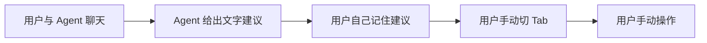
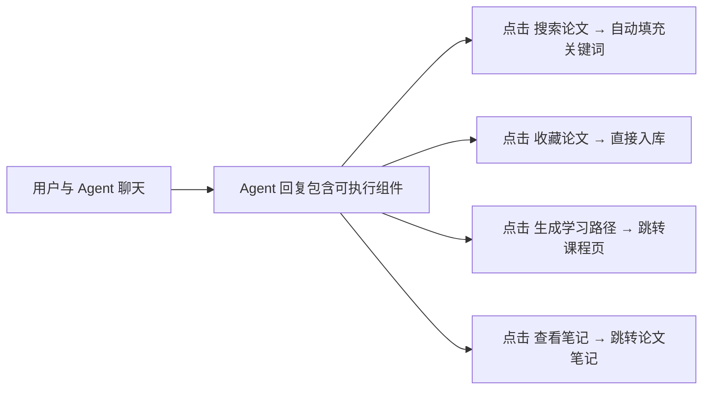

# RAIO2 产品设计优化方案

> 编写：设计原型专家团 | 日期：2026-07-08

---

## 目录

1. [诊断：以"科研人员的一天"走查产品](#一诊断以科研人员的一天走查产品)
2. [问题一：聊天 Agent 与功能页面割裂](#二问题一聊天-agent-与功能页面割裂-p0)
3. [问题二：主页信息层级颠倒](#三问题二主页信息层级颠倒-p0)
4. [问题三：功能之间缺少导航桥接](#四问题三功能之间缺少导航桥接-p1)
5. [问题四：学习模块缺少闭环](#五问题四学习模块缺少闭环-p1)
6. [问题五：信息架构与命名混乱](#六问题五信息架构与命名混乱-p2)
7. [改造优先级总览](#七改造优先级总览)

---

## 一、诊断：以"科研人员的一天"走查产品

模拟典型用户旅程，逐步走查 RAIO 的完整使用链路：

```
上午  → 打开 RAIO 看今日学术新闻
      → 看到一篇感兴趣的论文报道
      → 想保存这篇论文到图书馆
      → 想基于这个方向开启学习计划

下午  → 搜索这个领域的更多论文
      → 阅读 + 写笔记
      → 和 Agent 聊聊理解

晚上  → 回顾今天学的内容
      → 做测验检验掌握程度
```

在这个链路中，发现了 **5 个产品设计层面的断裂点**。

---

## 二、问题一：聊天 Agent 与功能页面割裂 (P0)

### 现象

用户和 Bookworm Agent 聊天：

> 用户："帮我找 Transformer 相关的论文"  
>  Agent："建议你搜索以下关键词：attention mechanism, transformer architecture, self-attention。可以在图书馆页面使用这些关键词进行检索。"

然后用户需要：
1. 记住 Agent 说的关键词
2. 手动切到"图书馆"Tab
3. 手动输入关键词搜索

**Agent 只是一个会说话的角色，不是一个能帮你操作的角色。** 这是评委说的"没有体现智能体价值"的核心原因之一。

### 当前状态



### 改造后



### 具体交互设计

#### 场景 A：Agent 推荐论文关键词

```
Agent 回复：
  "建议搜索以下方向："

  ┌────────────────────────────────────────────┐
  │ 🔍 "transformer attention mechanism"  [搜索]│
  │ 🔍 "self-attention survey 2024"       [搜索]│
  └────────────────────────────────────────────┘

  点击 → 自动跳转图书馆页 + 预填关键词 + 触发搜索
```

#### 场景 B：Agent 生成学习路径

```
Agent 回复：
  "已为你生成 Transformer 学习路径，共 10 章"
  
  ┌────────────────────────────────────────────┐
  │ 🎓 Transformer 深度学习路径      [开始学习] │
  │ 预计 30 天 · 10 章 · 适合 NLP 入门         │
  └────────────────────────────────────────────┘

  点击 → 跳转大师之路页面 + 自动展开该课程
```

#### 场景 C：Agent 分析论文

```
Agent 回复：
  "这篇论文的核心贡献是..."

  ┌────────────────────────────────────────────┐
  │ 📄 Attention Is All You Need                │
  │ Vaswani et al., 2017 · NeurIPS             │
  │ [收藏到图书馆] [写笔记] [找相关论文]          │
  └────────────────────────────────────────────┘
```

### 技术实现

修改 `buildMessages` 逻辑：
1. Agent system prompt 中增加输出格式指令：当涉及可执行操作时，在回复末尾附加 JSON 元数据块
2. 前端 `MarkdownPreview` 组件检测元数据，渲染为可交互的 Action Card
3. Action Card 点击 → 调用路由跳转 + 传递参数（如预填关键词）

```javascript
// Agent 回复末尾附加的结构
// <!--action:{"type":"search","params":{"query":"transformer attention"}}-->
```

---

## 三、问题二：主页信息层级颠倒 (P0)

### 现象

打开 RAIO 主页，用户（以及评委）第一屏看到什么？

| 当前布局 | 问题 |
|---------|------|
| 全局画像雷达图 | ✅ 还算相关 |
| 成就徽章 | ⚠️ 锦上添花，不应占首屏主位 |
| 待办列表 | ❌ 非核心，评委已点名 |
| 花园种植 | ❌ 与科研定位无关 |
| 心情记录 | ❌ 同上 |
| **聊天对话框** | 💀 **核心功能在页面下方** |

"评委 30 秒定生死"——前 30 秒看到的全是和科研核心价值无关的东西。核心的聊天功能需要滚动才能看到。

### 当前布局 vs 建议布局

```
当前主页布局                      建议主页布局

┌─────────────────────┐          ┌─────────────────────────┐
│ 全局画像雷达         │          │ 🗨️  Agent 对话框  (占 60% 屏)│
├─────────────────────┤          │                         │
│ 成就徽章             │          │  [用户今天想做什么？]       │
├────────────────┬────┤          │                         │
│ 待办列表       │花园 │          │  快捷入口：               │
│               │     │          │  📚 搜论文  🎓 学知识    │
│               │     │          └─────────────────────────┘
├────────────────┴────┤          ┌──────────┬──────────────┐
│ 心情记录             │          │ 收藏论文  │ 学习进度      │
├─────────────────────┤          │ (3 篇未读)│ (第 5/30 天) │
│ Chat 区 (需滚动)     │          ├──────────┼──────────────┤
└─────────────────────┘          │ 今日动态  │ 成就速览      │
                                 │ "你关注了."│ ⭐ 3/10      │
                                 └──────────┴──────────────┘
```

### 核心改动

1. **对话框提到页面顶部**，占首屏 60% 以上面积，用户打开就能对话
2. **快捷入口卡片**直接放在对话框下方——"今天的任务"
3. **成就、新闻动态**移到底部或侧栏，变成"进来就能看到"但不是"首先看到"
4. **待办、花园、心情**全部移除（对应战役一的去伪存真）

---

## 四、问题三：功能之间缺少导航桥接 (P1)

### 现象

"新闻联动"是个好功能——关注一条学术新闻会自动存论文、生成微课程。但问题是**用户不知道这件事发生了**。

```
用户点击"关注" → 弹出一行文字
  "已关注：核心文献已进入图书馆，微学习路径已生成"
                      ↓
            然后呢？用户需要：
            1. 记住这句话
            2. 手动切到"图书馆"Tab
            3. 在论文列表里翻找
            4. 手动切到"大师之路"Tab
            5. 在课程列表里翻找
```

### 改造方案

关注成功后的反馈从"纯文字通知"改为"可操作的跳转卡片"：

```
┌─────────────────────────────────────────────────┐
│ ✅ 已关注：Attention Is All You Need             │
│                                                 │
│ 📚 论文已存入图书馆     [去看看 →]               │
│ 🎓 微学习路径已生成     [开始学习 →]             │
│ 📝 已加入全局记忆       [查看记忆 →]             │
└─────────────────────────────────────────────────┘
```

点击即跳转到对应页面的对应条目，无需用户自己找。

### 适用的联动场景

| 触发动作 | 联动结果 | 导航桥接 |
|---------|---------|---------|
| 聊天中 Agent 生成课程 | 自动创建到大师之路 | 回复中嵌入 [开始学习 →] |
| 关注新闻 | 自动存论文 + 生成微课 | 反馈卡片含跳转链接 |
| 收藏论文 | 记入全局记忆 | 侧边栏提示 [查看笔记 →] |
| 学习测验完成 | 推荐相关论文 | 提示 [了解更深入 →] |

---

## 五、问题四：学习模块缺少闭环 (P1)

### 现状

学习路径的功能链路看起来完整：

```
选主题 → 生成大纲 → 浏览章节 → 做测验 → 得分
```

但存在两个关键缺失。

### 缺失一：新用户不知道从哪里开始

打开"大师之路"页面，看到的是已生成课程的空列表或少量课程卡片。对于新用户：

- 没有引导："你最近收藏了 3 篇关于 Transformer 的论文，基于这些生成学习路径？"
- 没有推荐："科研人员常学的热门路径：深度学习基础、NLP 入门、..."

**缺少入口引导**意味着功能存在，但用户不会用。

#### 改造方案

在大师之路页面顶部增加引导区：

```
┌─────────────────────────────────────────────────┐
│ 💡 开始学习                                       │
│                                                 │
│ 最近收藏方向：Transformer, NLP, 深度学习          │
│ [基于论文库生成学习路径 →]                        │
│                                                 │
│ 或选择热门路径：                                  │
│ [NLP 基础] [深度学习] [强化学习] [CV 入门]         │
└─────────────────────────────────────────────────┘
```

### 缺失二：没有复习和追踪

做完测验 → 显示得分 → 结束。没有：
- 间隔重复提醒："你 7 天前学习了第 3 章，建议今天复习"
- 学习进度趋势：不是只有完成/未完成，而是能看到自己的进步
- "100 天学习计划"命名暗示长期跟踪，实际体验是"一次性消费"

#### 改造方案

1. **每日提醒卡片**（在主页快捷入口区）：

```
┌────────────────────────────────────────────┐
│ 🎓 今日学习                                │
│  NLP 基础 · 第 5 章 · 注意力机制            │
│  上次学习：7 天前 · 建议复习                │
│  [继续学习 →]                               │
└────────────────────────────────────────────┘
```

2. **错题追踪**（数据库已支持，需前端展示）：

```
┌────────────────────────────────────────────┐
│ 📊 学习统计                                │
│  正确率趋势：📈 60% → 75% → 85%            │
│  薄弱知识点：位置编码(40%) · 多头注意力(55%) │
│  [专项练习 →]                               │
└────────────────────────────────────────────┘
```

3. **题库持久化**：

当前测验题每次都是重新生成的，队友也提到应该缓存。改造：
- 首次生成后存入 `learn_progress.quiz_json`
- 用户答案也持久化，支持回顾错题
- 错题标签 `wrong_tags` 用于针对性出题

---

## 六、问题五：信息架构与命名混乱 (P2)

### 现状导航

```
🏠 主页     📚 图书馆     🎓 大师之路     📰 八卦早知道     🌻 活着
```

### 问题分析

| 导航项 | 问题 | 影响 |
|--------|------|------|
| "八卦早知道" | 不像学术产品命名 | 评委 / 用户第一印象混乱 |
| "活着" | 过于隐晦，不知道是什么 | 新用户困惑，降低探索欲望 |
| 没有独立的"对话"入口 | 核心功能隐藏在主页内部 | 用户离开主页后找不到对话入口 |

### 建议命名

| 当前 | 建议 | 理由 |
|------|------|------|
| 八卦早知道 | 学术动态 | 清晰、学术场景 |
| 活着 | 个人中心 | 直观，含设置、成就、统计 |
| 大师之路 | 学习路径 | 更直觉化，或保留但加副标题 |

### 建议增加

| 增加 | 理由 |
|------|------|
| 全局对话入口（固定在顶部栏或右下角悬浮） | 用户在任何页面都能随时唤起对话，这是 Agent 产品的核心体验 |

### 建议信息架构

```
顶部栏
├── RAIO Logo + 名称
├── 导航：主页 | 图书馆 | 学习路径 | 学术动态 | 个人中心
├── 全局对话按钮（常驻，悬浮或固定）
└── 用户头像 + 退出

主页
├── 对话区（核心，占 60%）
├── 快捷入口卡（今日论文 / 学习进度）
├── 近期动态（关注了哪些新闻、收藏了哪些论文）
└── 成就速览（小侧栏，不占主视觉）
```

---

## 七、改造优先级总览

| 优先级 | 问题 | 类型 | 影响范围 | 技术复杂度 |
|--------|------|------|---------|-----------|
| **P0** | 聊天 Agent 与功能页割裂 | 交互架构 | 聊天系统 + 多页面 | 中 |
| **P0** | 主页信息层级颠倒 | 布局重排 | 主页 | 低 |
| **P1** | 功能间缺少导航桥接 | 用户流程 | 新闻/图书馆/学习 | 低 |
| **P1** | 学习缺少闭环 | 功能完整性 | 学习模块 | 中 |
| **P2** | 信息架构与命名 | 导航重构 | 全局导航 | 低 |

### 实施建议

这些改动**不依赖视觉改版**——可以在现有的像素风 UI 上直接改布局和交互逻辑。视觉改版（字体、配色、组件风格）可以后续叠加。

建议顺序：
1. 先改 P0（主页重布局 + Agent 回复可执行），这两项改动最容易被感知
2. 再补 P1（导航桥接 + 学习闭环），让现有功能之间的链路串起来
3. 最后调 P2（命名 + 导航），全局一致性收尾
