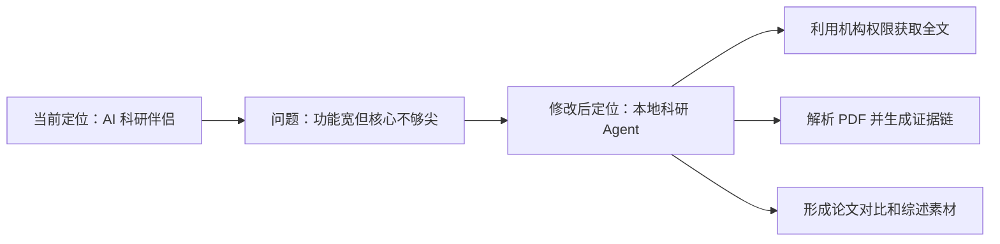
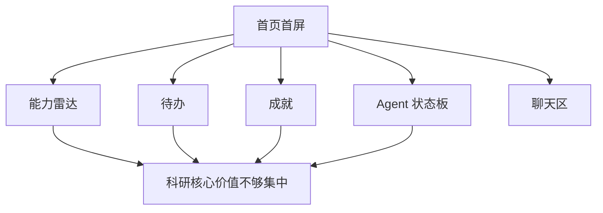
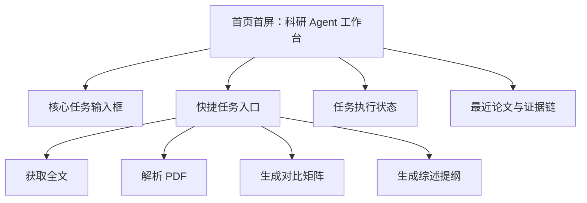
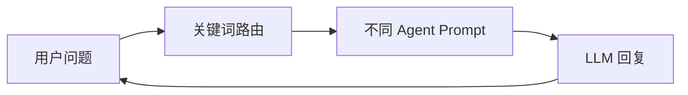
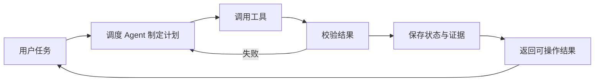
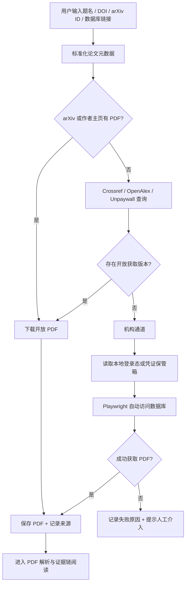
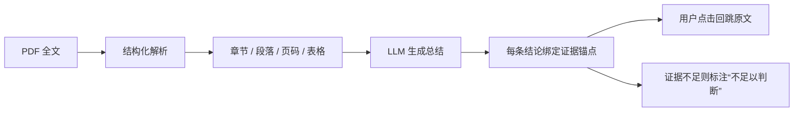
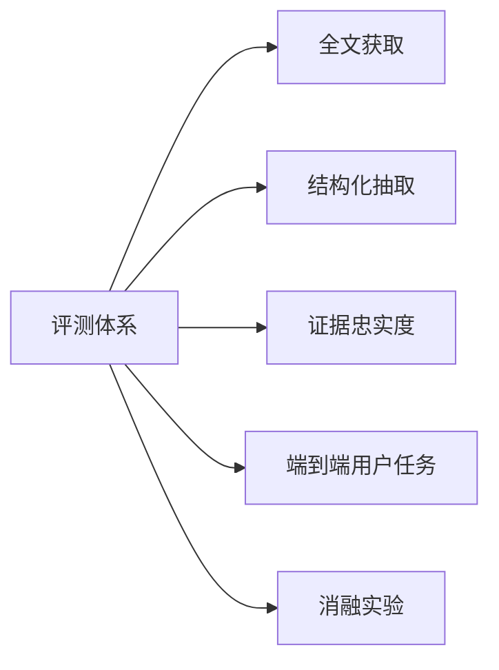
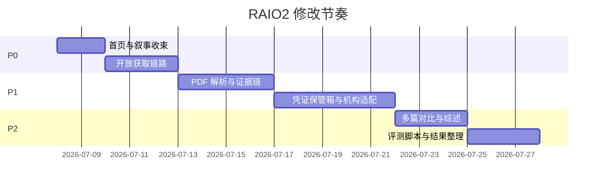

# RAIO2 中期评审后修改说明

> 目标：将 RAIO2 从“功能完整的科研助手”收束为“能利用本地机构权限完成全文获取与证据链阅读的科研 Agent 系统”。

## 1. 修改总览

| 评审意见 | 当前差距 | 修改方向 | 验收结果 |
|---|---|---|---|
| 花园种植、心情记录与科研辅助定位不符 | 生活化叙事和游戏化元素占据注意力 | 弱化生活化模块，首页改为科研 Agent 工作台 | 首屏突出论文、全文、证据链、任务进度 |
| Agent 要做 LLM 做不到的事 | 当前 Agent 主要是 Prompt 分工和聊天回复 | 增加工具调用、浏览器自动化、本地凭证、全文获取链 | Agent 可执行检索、登录、获取、解析、保存 |
| 缺少特色和创新性 | 论文搜索、总结、学习路径同类产品已有 | 聚焦“凭证驱动全文获取 + 证据链阅读” | 形成可清晰讲述的核心创新点 |
| 缺少效果评价 | 目前偏功能演示，缺指标 | 建立全文获取、抽取、忠实度、端到端评测 | 输出评测表、样本集和初步结果 |

## 2. 定位变化

| 维度 | 修改前 | 修改后 |
|---|---|---|
| 产品重心 | 论文、学习、新闻、待办、生活陪伴并列 | 文献全文获取与证据链阅读优先 |
| Agent 价值 | 回答、推荐、总结、规划 | plan → act → verify 的任务执行 |
| 差异化 | 多功能集成 | 本地凭证 + 机构数据库 + 可追溯证据 |
| 展示方式 | 展示页面完整度 | 展示真实科研任务闭环 |

一句话口径：

**普通 LLM 只能回答问题；RAIO2 能在用户授权下进入真实科研环境，获取全文、解析论文，并把 AI 结论绑定回原文证据。**

## 3. 功能取舍

| 模块 | 当前状态 | 修改动作 | 优先级 | 说明 |
|---|---|---|---|---|
| 首页 Agent 对话 | 已实现 | 前置为首屏核心区域 | P0 | 展示“任务入口”而非普通聊天 |
| 图书馆 | 已实现 arXiv 搜索、收藏、总结 | 增加“获取全文”“解析 PDF”“证据链总结” | P0/P1 | 成为主战场 |
| 新闻视野 | 已实现资讯与联动 | 保留，但服务于文献发现 | P1 | 关注新闻后进入全文链路 |
| 大师之路 | 已实现学习路径 | 保留为辅助，不作为核心创新 | P2 | 后续可由论文库生成学习路线 |
| 待办 | 已实现 | 降级为科研任务清单 | P0 | 只承接阅读、综述、实验任务 |
| 成就/能力雷达 | 已实现 | 弱化展示 | P0 | 不再作为主卖点 |
| 生活 Agent / 花匠 | 已实现 | 从主导航和核心叙事中移除 | P0 | 仅保留必要的待办辅助能力 |
| 像素农场叙事 | 文案和 UI 中存在 | 改为专业科研工作台叙事 | P0 | 避免削弱科研可信度 |

## 4. 首页改造图

### 当前问题

### 修改后结构

| 区域 | 修改前 | 修改后 | 对应代码 |
|---|---|---|---|
| 首屏主区 | 普通聊天面板 | 科研任务 Agent 面板 | `src/pages/HomePage.jsx` |
| 右侧面板 | 能力雷达、待办、成就 | 任务状态、最近论文、待核验证据 | `src/pages/HomePage.jsx` |
| Agent Dock | 角色切换 | 工具型任务入口 | `src/pages/HomePage.jsx` |
| 底部状态板 | Agent 人设展示 | 可删除或压缩 | `src/pages/HomePage.jsx` |
| 页脚文案 | “用星露谷的方式做科研” | “本地科研 Agent 工作台” | `src/components/Layout.jsx` |

## 5. Agent 架构改造

### 当前 Agent 形态

### 目标 Agent 形态

| Agent | 当前定位 | 修改后定位 | 工具能力 |
|---|---|---|---|
| 调度 Agent | 理解意图、分配角色 | 拆解任务、选择工具、校验结果 | 任务计划、状态追踪、失败重试 |
| 文献 Agent | 搜索建议、摘要总结 | 全文获取与元数据补全 | arXiv、Crossref、OpenAlex、Unpaywall |
| 阅读 Agent | 论文伴读 | PDF 解析与结构化抽取 | PDF parser、章节识别、表格抽取 |
| 证据 Agent | 暂无 | 结论-原文证据绑定 | 页码、段落、原文片段、引用核验 |
| 综述 Agent | 学习/总结辅助 | 多篇论文对比和 related work 草稿 | 对比矩阵、引用网络、主题聚类 |
| 生活 Agent | 情绪和待办 | 不作为核心展示 | 可保留待办辅助 |

## 6. 全文获取链

| 子能力 | 说明 | 对应实现 |
|---|---|---|
| 元数据补全 | 根据题名、DOI、arXiv ID 补全论文信息 | 新增 `server/paperResolver.js` |
| 开放获取链路 | 优先使用 arXiv、OpenAlex、Unpaywall | 新增 `/api/papers/resolve`、`/api/papers/:id/fulltext` |
| 机构通道 | 使用本地授权访问 IEEE/ACM/Elsevier/知网 | 新增 `server/providers/` |
| 浏览器自动化 | 自动检索、跳转、点击 PDF | Playwright |
| 凭证保管箱 | 本地加密保存账号信息 | 新增 `server/vault.js` |
| 执行日志 | 记录每一步成功、失败和耗时 | 新增 `paper_fetch_runs` 表 |

合规边界：

| 边界 | 要求 |
|---|---|
| 凭证来源 | 仅使用用户本人合法授权 |
| 使用范围 | 仅个人学习和科研用途 |
| 数据流向 | 凭证不上传、不进 LLM 上下文 |
| 自动化限制 | 不破解验证码，不绕过技术保护 |
| 失败处理 | 需要人工认证时暂停并提示用户 |

## 7. 证据链阅读

| 输出内容 | 修改前 | 修改后 |
|---|---|---|
| TL;DR | 基于摘要生成 | 基于全文生成，附证据 |
| 核心贡献 | 自然语言总结 | 每条贡献绑定页码/段落 |
| 方法与实验 | 摘要不足时难判断 | 抽取方法、数据集、指标、baseline |
| 局限性 | 依赖模型推断 | 必须引用原文依据 |
| 多篇对比 | 暂无 | 方法 × 数据集 × 指标 × 结果矩阵 |

建议输出格式：

| 字段 | 示例 |
|---|---|
| conclusion | 本文提出了一种新的检索增强生成框架 |
| evidence.page | 3 |
| evidence.text | 原文片段 |
| evidence.type | method / experiment / limitation |
| confidence | high / medium / low |

## 8. 代码修改对照清单

| 状态 | 文件/模块 | 当前问题 | 修改动作 | 优先级 |
|---|---|---|---|---|
| [x] | `src/pages/HomePage.jsx` | 首屏仍偏聊天和画像展示 | 改成科研任务工作台，增加全文/解析/对比入口 | P0 |
| [x] | `src/components/Layout.jsx` | 页脚和品牌叙事偏游戏化 | 改为专业科研 Agent 文案 | P0 |
| [x] | `server/agents.js` | 关键词路由 + Prompt 分工 | 加入工具调用计划输出和任务类型识别 | P0 |
| [x] | `src/pages/LibraryPage.jsx` | 只有搜索、收藏、笔记、摘要总结 | 增加“获取全文”按钮与 DOI/URL 单篇添加入口 | P0 |
| [x] | `src/api/index.js` | 缺全文获取相关 API 封装 | 增加 fulltext 和 fetch-runs 接口 | P0 |
| [x] | `server/index.js` | 论文接口只支持 arXiv 和摘要总结 | 增加 arXiv 全文获取、校园网单篇直取和获取日志接口 | P0 |
| [x] | `server/db.js` | 缺 PDF、证据、执行日志表 | 增加 papers 全文字段、DOI 字段和 fetch 日志表 | P0 |
| [ ] | `server/paperResolver.js` | 暂无 | 新增 Crossref/OpenAlex/Unpaywall 元数据补全 | P1 |
| [ ] | `server/vault.js` | 暂无 | 新增本地凭证加密保管箱 | P1 |
| [ ] | `server/providers/` | 暂无 | 新增 IEEE/ACM 等机构适配器 | P1 |
| [ ] | `eval/` | 暂无评测脚本 | 新增获取率、抽取、忠实度评测 | P1/P2 |
| [x] | `README.md` | 仍强调全流程陪伴和生活化特色 | 改为全文 Agent 与证据链定位 | P0 |

## 9. 数据结构补充

| 表/字段 | 用途 | 关键字段 |
|---|---|---|
| `papers` 全文扩展 | 保存 DOI、来源类型和本地 PDF 状态 | `doi`, `identifier_type`, `pdf_path`, `pdf_source`, `pdf_status` |
| `paper_fetch_runs` | 记录全文获取过程 | `paper_id`, `steps`, `status`, `duration_ms`, `error` |
| `paper_sections` | 保存 PDF 解析结果（P1） | `paper_id`, `section_title`, `page_start`, `content` |
| `paper_evidence` | 保存证据锚点（P1） | `paper_id`, `claim`, `page`, `snippet`, `confidence` |
| `credential_vault` | 保存本地凭证元信息（P1） | `provider`, `account_mask`, `encrypted_blob` |
| `eval_runs` | 保存评测结果（P2） | `type`, `dataset`, `metrics`, `created_at` |

## 10. API 对照

| API | 方法 | 功能 | 阶段 |
|---|---|---|---|
| `/api/papers/save` | POST | 收藏 arXiv 论文，或手动添加 DOI/URL 单篇论文 | P0 |
| `/api/papers/:id/fulltext` | POST | 执行 arXiv 全文获取与校园网单篇直取 | P0 |
| `/api/papers/:id/fetch-runs` | GET | 查看全文获取日志 | P0 |
| `/api/papers/resolve` | POST | 根据题名/DOI/arXiv ID 补全元数据 | P1 |
| `/api/papers/:id/parse` | POST | 解析 PDF | P1 |
| `/api/papers/:id/evidence-summary` | POST | 生成证据链总结 | P1 |
| `/api/papers/compare` | POST | 多篇论文对比矩阵 | P2 |
| `/api/vault/credentials` | GET/POST/DELETE | 管理本地凭证 | P1 |
| `/api/eval/run` | POST | 运行评测 | P2 |

## 11. 评测体系

| 评测项 | 数据集 | 指标 | 对照对象 |
|---|---|---|---|
| 全文获取 | 100 篇论文，覆盖 arXiv/IEEE/ACM/Elsevier/知网 | 成功率、平均耗时、失败原因 | 无凭证 / 有凭证 / 人工 |
| 结构化抽取 | 30 篇人工标注论文 | Precision、Recall、F1 | 人工标注 |
| 证据忠实度 | 系统生成的总结条目 | 可支持比例、证据定位准确率、错误引用率 | 人工核验 |
| 端到端任务 | 同主题文献调研任务 | 完成时间、质量评分、引用准确性 | 裸 LLM / 普通工具 / RAIO2 |
| 消融实验 | 同一批论文问题 | 摘要版 vs 全文版 vs 证据链版准确率 | 系统内部对照 |

## 12. 阶段计划

| 阶段 | 目标 | 必做事项 | 验收标准 |
|---|---|---|---|
| P0：聚焦主线 | 让评委一眼看到科研 Agent 价值 | 首页改造、弱化生活化元素、开放获取链路、全文按钮、执行日志 | OA 论文可一键获取，首页主线清晰 |
| P1：能力落地 | 打通真实 Agent 闭环 | PDF 解析、证据链总结、凭证保管箱、1-2 个机构适配器 | 展示“获取→解析→证据回跳”完整流程 |
| P2：证明有效 | 补齐创新和评价 | 多篇对比、综述草稿、评测脚本、用户实验 | 输出指标表和对比结果 |

## 13. 风险与控制

| 风险 | 影响 | 控制方式 |
|---|---|---|
| 数据库验证码或双因素认证 | 自动获取失败 | 不破解，提示用户手动认证或复用登录态 |
| 各学校认证方式不同 | 适配成本高 | provider 插件化，先做 1-2 个演示适配器 |
| 凭证安全风险 | 影响可信度 | 本地加密，凭证不进模型上下文 |
| PDF 解析不稳定 | 影响证据链质量 | 先支持文本 PDF，扫描件 OCR 后置 |
| LLM 生成证据不可靠 | 影响学术可信度 | 强制证据锚点校验，证据不足则标注 |
| 时间不足 | 影响完整落地 | P0 先保证开放获取链路和清晰展示 |

## 14. 下一步执行顺序

| 顺序 | 任务 | 产出 |
|---|---|---|
| 1 | 改首页和文案，压低生活化元素 | 新首页结构、README 新定位 |
| 2 | 给图书馆加“获取全文”入口 | 前端按钮和 API 调用 |
| 3 | 实现开放获取链路 | arXiv/OpenAlex/Unpaywall 获取 PDF |
| 4 | 保存执行日志 | 可展示的 step 级获取过程 |
| 5 | 接入 PDF 解析 | 章节、页码、段落抽取 |
| 6 | 生成证据链总结 | 结论绑定原文证据 |
| 7 | 补评测脚本 | 获取率、抽取、忠实度结果 |

最终答辩口径：

**RAIO2 的核心改动不是增加更多功能，而是把 Agent 接入真实科研工作流：用本地授权获取论文全文，用结构化解析理解论文，用证据链约束 AI 输出，并用评测证明效果。**
